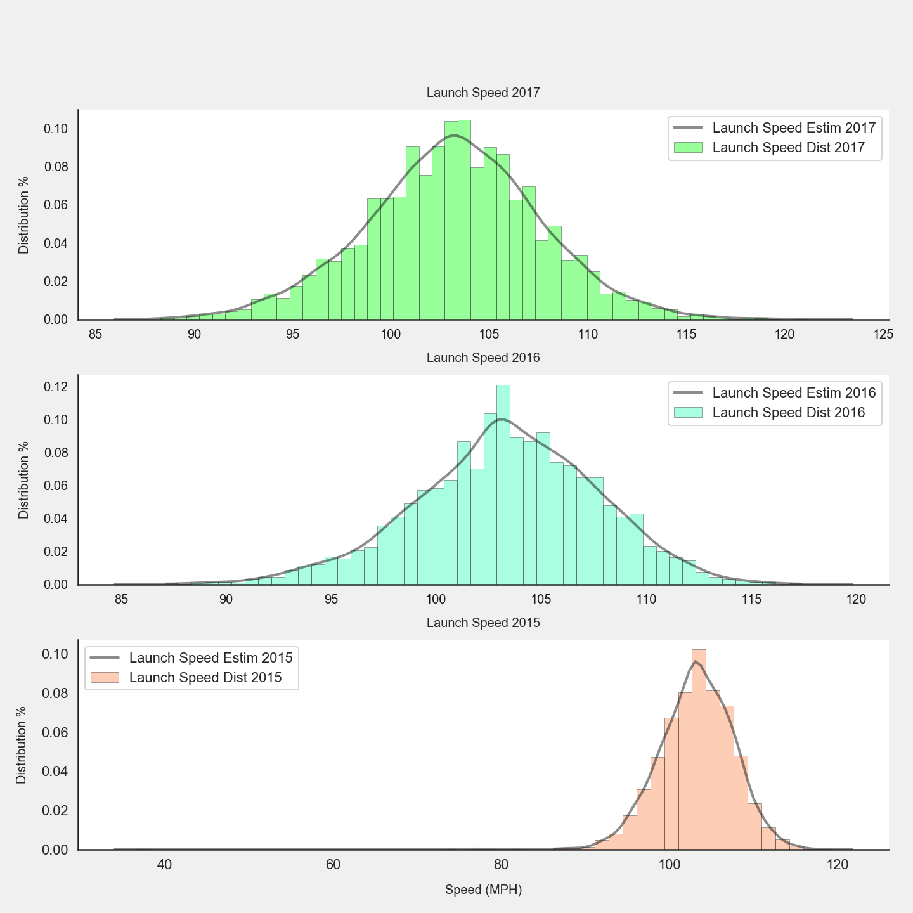
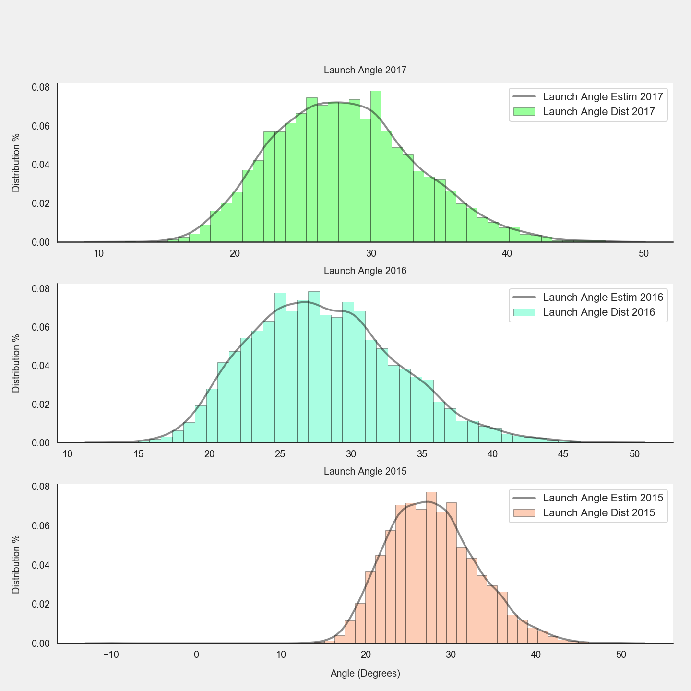
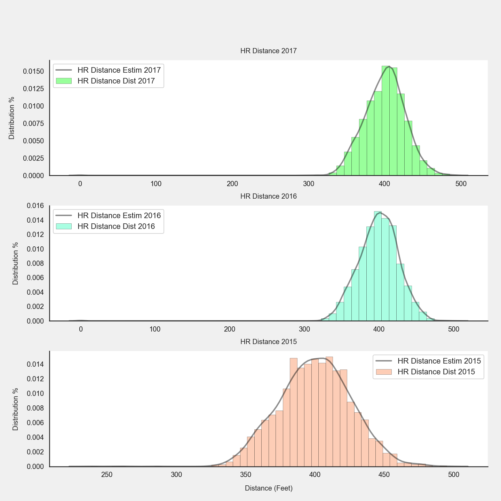
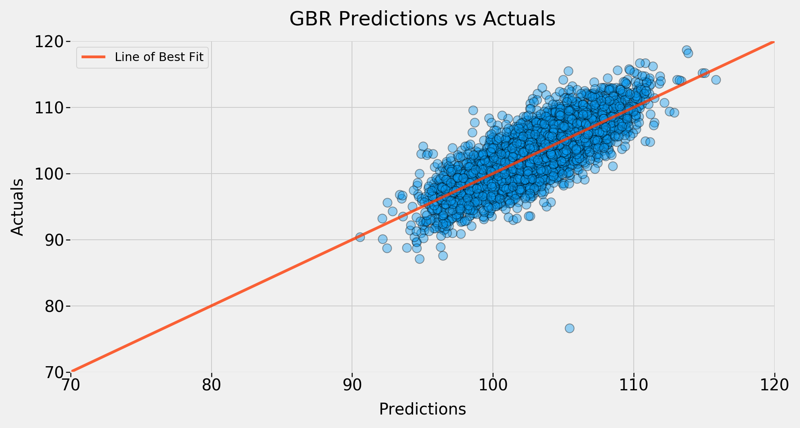

<h1 align="center">Major League Baseball Home Run Exit Velocities</h1>

---

*Jon Nelson*

---

## Outline

- [Description](#description)
- [Problem statement](#problem-statement)
- [File Structure](#file-structure)
- [Data Dictionary](#data-dictionary)
- [Exploratory Data Analysis](#exploratory-data-analysis)
- [Production Modeling](#production-modeling)
- [Conclusions and Next Steps](#Conclusions-and-next-steps)

## Description

One of the most recent debates in Major League Baseball is focused on why more home runs were hit in the 2017 season than any other season in the leagues history. There were 6,105 home runs hit in the 2017 season, which is more home runs than in the peak of the steroid era and everyone wants to know why. One specific area of interest for investigation is related to the most important item to the game, the baseball. During the 2017 season there were numerous complaints from major league pitchers that the ball felt different and the result was a record breaking year for home runs.

Thanks to Baseball Savant and their StatCast technology we can begin to understand what is happening by analyzing the data tracked on every pitch that was hit for a home run. After a high level review of the data and some outside research I found a specific stat known as the Home Run Exit Velocity which is defined by Baseball Savant as the speed at which the baseball leaves the bat after being hit. Home Run Exit Velocity will be the target variable for my investigation into what is causing an increase in home runs.

Using machine learning techniques I will build a production level regression model to draw a conclusion on what features involved in a home run are most influential to the home run exit velocity. The data that will be used to train this model will come from three different aspects:
1. StatCast pitch data for all home run hits
2. Data for a sample of baseballs used in the 2015, 2016 and 2017 seasons
3. Baseball player personal stats (height, weight, age)

---

## Problem Statement

Using the physical data about baseballs, the personal stats from each player (age, height, weight) and the game statistics from each pitch that was hit for a home run, between the years of 2015 and 2017, I will draw a conclusion about the most influential features contributing to a batter’s home run exit velocity.

---

## File Structure

- <a href="data">data</a>
- <a href="notebooks">notebooks</a>
- <a href="pickles">pickles</a>
- <a href="plots">plots</a>
- <a href="presentation">presentation</a>
- [README.md](./README.md)

---

## Data Dictionary

---

#### Pitch Features

  - `pitch_type`: The type of pitch that was thrown and hit for a home run
      - `CH : Changeup`
      - `CU : Curveball`
      - `EP : Eephus`
      - `FC : Cut Fastball (Cutter)`
      - `FF : Four-seam Fastball`
      - `FO : Pitch Out`
      - `FS : Sinking Fastball / Split-Fingered (Splitter)`
      - `FT : Two-seam Fastball`
      - `KC : Knuckle-curve`
      - `KN : Knuckleball`
      - `SC : Screwball`
      - `SI : Sinker`
      - `SL : Slider`
  - `p_throws`: the strong hand in which the pitcher threw the pitch
  - `pfx_x`: the horizontal movement, in inches, of the pitch between the release point and home plate, as compared to a theoretical pitch thrown at the same speed with no spin-induced movement. This parameter is measured at y=40 feet regardless of the y0 value.
  - `pfx_z`: the vertical movement, in inches, of the pitch between the release point and home plate, as compared to a theoretical pitch thrown at the same speed with no spin-induced movement. This parameter is measured at y=40 feet regardless of the y0 value.
  - `vx0`: the velocity of the pitch, in feet per second, in three dimensions, measured at the initial point.
  - `vy0`: the velocity of the pitch, in feet per second, in three dimensions, measured at the initial point.
  - `vz0`: the velocity of the pitch, in feet per second, in three dimensions, measured at the initial point.
  - `ax`: the acceleration of the pitch, in feet per second per second, in three dimensions, measured at the initial point.
  - `ay`: the acceleration of the pitch, in feet per second per second, in three dimensions, measured at the initial point.
  - `az`: the acceleration of the pitch, in feet per second per second, in three dimensions, measured at the initial point.
  - `effective_speed`: the (actual) speed of the pitch upon the ball crossing home plate
  - `release_speed`: the (perceived) speed of the pitch upon release from the pitcher
  - `release_spin_rate`: how much spin, in revolutions per minute, a pitch was thrown with upon release.
  - `release_extension`: how far off the mound, in feet, a pitcher releases the pitch.
  - `release_pos_y`: the release coordinates in three dimensions, measure at the initial release point.
  - `release_pos_x`: the release coordinates in three dimensions, measure at the initial release point.
  - `release_pos_z`: the release coordinates in three dimensions, measure at the initial release point.

#### MLB Features

  - `game_year`: the season the home run hit occurred (2015, 2016 and 2017).
  - `weight_(oz)`: the weight of the baseballs in oz from each season (2015, 2016 and 2017).
  - `circumference_(in)`: the circumference of the baseballs in inches from each season (2015, 2016 and 2017).
  - `avg_seam_height`: seam height was defined as the average radial distance from the seam to the ear, 3 mm left and right of the seam.
  - `avg_ccor`: cylindrical coefficient of restitution (ccor) is the measurement of the "bounciness" of the baseball and is the core ingredient of "the pill" the middle rubber of the baseball.
  - `avg_ds`: a measure of a ball's hardness. Its measurement is conducted to represent bat-ball impact forces.

#### Batter Features

  - `player_name`: the name of the player that hit the home run
  - `height`: the height in inches of the player that hit the home run
  - `weight`: the weight in lbs of the player that hit the home run
  - `age`: the age of the player that hit the home run
  - `hit_distance_sc`: the distance the ball traveled from home plate
  - `launch_speed`: **(Target Variable)** aka exit velocity, measures the speed (mph) of the baseball as it comes off the bat, immediately after a batter makes contact.
  - `launch_angle`: how high, in degrees, a ball was hit by a batter.
  - `bb_type`: the type of hit that came off the bat (fly ball or line drive) for a home run.
  - `sz_top`: the distance in feet from the ground to the top of the current batter’s rulebook strike zone as measured from the video by the PITCHf/x operator. The operator sets a line at the batter’s belt as he settles into the hitting position, and the PITCHf/x software adds four inches up for the top of the zone
  - `sz_bottom`: the distance in feet from the ground to the bottom of the current batter’s rulebook strike zone. The PITCHf/x operator sets a line at the hollow of the knee for the bottom of the zone.
  - `zone`: the location of the pitch as is crossed home plate according to the mapped areas of the batters zone box (1 - 14).
  - `plate_x`: strike zone coordinate x
  - `plate_z`: strike zone coordinate z

  ---

## Exploratory Data Analysis

Exploring home run data to identify relationships and trends that can help explain what is contributing to a batters home run exit velocity.

### Exploration of Distributions by Year

I am focused on understanding what is influencing Home Run Exit velocities to find insights into what is causing an increase in home runs so I want to review the differences in launch speeds, launch angles and hit distances by year.

#### Launch Speeds

The 2015 season looks to have a much longer tail to the left hand side meaning there were some much slower home velocities in that year compared to the 2016 and 2017 season. The 2016 and 2017 seasons distributions look almost identical with the main difference being the fact that in 2017 we saw a record breaking number of home runs so there are more observations to show in the distribution.

  

#### Launch Angles

The launch angles between seasons is pretty consistent but one thing I am noticing is that there is a large increase in home runs that were between the angles of 25 and 50. Meaning that more "Fly Ball" home runs are being hit (more on this later).

- Batted Ball Type by Launch Angle:
    - Ground ball: Less than 10 degrees
    - Line drive: 10-25 degrees
    - Fly ball: 25-50 degrees
    - Pop up: Greater than 50 degrees

  

#### Home Run Distances

What shows itself immediately as far as home run distances is the fact that in the 2017 and 2016 seasons the batters are consistently hitting home runs further on average at around 400ft compared to the 2015 season which has more spread across 375ft to 425ft.

  

---

## Production Modeling

### GridSeach with GradientBoostRegressor

#### GridSearchCV

GridSearchCV is a technique that searches for the optimal hyper-parameters provided during the instantiating of the GridSearchCV model. Using its built in cross validation it can search over the grid of the provided hyperparameters to evaluate the performance of each and then use the parameter(s) it found to be the best when making the predictions.

#### Gradient Boost

When boosting a model the model is building multiple simple models and learning from these models to be more approximate when predicting. These simple models are referred to as weak model or weak learners.

Gradient Boosting looks at these weak models sequentially and trains on the residuals or errors in order to give more importance to the less accurate predictions and once completed uses what was learned from these predictions to combine with the strong predictions to have a better overall approximation.

#### Gradient Boost Scores

|Train Score |Test Score |
|------------|-----------|
|   0.68038  |  0.61657  |

##### Interpretations

1. The train data explained variance (R2) means, 68% of the variations in the predicted launch speeds can be explained by the feature variables within the model.
2. The test data explained variance (R2) means, 61% of the variations in the predicted launch speeds can be explained by the feature variables within the model.
3. Overall, this model is still over fit but the percentage of explained variance is the best I've seen amongst all models.

#### Gradient Boost predictions

  

---

## Conclusions and Next Steps

### Model

From the data I collected from Baseball Savant on pitch information, the data from the sample of baseballs used in the 2015, 2016 and 2017 seasons and the web scrape data of each batters age, height and weight the features I saw that most influenced a batters home run exit velocity relate to the pitch stats, as well as the height and the weight of the player. These two groups made up all of the top 20 most influential features to the Gradient Boost model and provided the model the necessary information it needed to be as accurate as it was in predicting launch speeds.

As far as the baseballs, I don't see any significant evidence that the ball has any affect on a batters launch speed. The most important baseball features carried the following weights in the model:

| Avg CCOR   | Avg DS    | Weight   |
|------------|-----------|----------|
|  0.001344  | 0.003617  |   0.0    |

### Next Steps

During EDA I found that there were more Fly Ball home runs hit in the 2017 season than in the 2015 and 2016 seasons and it was actually significantly more Fly Ball home runs than either of the previous two seasons. I would like to review what has triggered batters to adjust to hitting more Fly Ball home runs along with reviewing some research that reviews the drag coefficient of the baseball to determine if the ball is having any affect on the flight after being hit and ultimately leaving the ball park for a home run.
- https://fivethirtyeight.com/features/in-mlbs-new-home-run-era-its-the-baseballs-that-are-juicing/

  

Another area I would like to build on is adding more pitch observations to my data in order to analyze pitches that are not hit for home runs. I think that this would provide additional insights into the types of pitches that batters are able to hit out of the park on a regular basis. This would also provide additional examples to be examined related to batted ball types (Fly Balls or Line Drives) to continue to build on the idea that batters are adjusting their swings in order to hit more Fly Balls.
